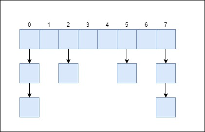

# HashMap详解

本篇文章将通过以下几个部分详细解析 `java` 中 `hashmap` 的实现原理：

- jdk7中的HashMap实现
- jdk7中的ConcurrentHashMap实现
- jdk8中的HashMap实现
- jdk8中的ConcurrentHashMap实现

## 1. JDK7-HashMap揭秘

hashmap作为一个容器，其作用便是存储数据，HashMap在JDK7中与JDK8中的存储接口发生了较大的变化，在JDK7中存储的方式为 **`数组`** + **`单链表`**的 形式存储，其模型如下图所示：

